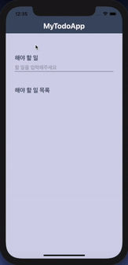

# [Likelion7th]my_todo App

Likelion7th 수업에서 ReactNative로 클론코딩한 앱 입니다.

---

### 결과물

---

### 요약

1. react-native에서 제공하는 **TextInput**, **TouchableOpacity** 등을 이용해 UI를 구성합니다.
2. react-native에서 제공하는 **FlatList**를 사용하여 state, props를 주고 받으며 앱이 활성화 되어있을때의 CRUD를 구현합니다.
3. expo에서 제공하는 async-storage모듈에서 **AsyncStorage**를 사용해서 핸트폰 로컬 저장소에 저장합니다.
